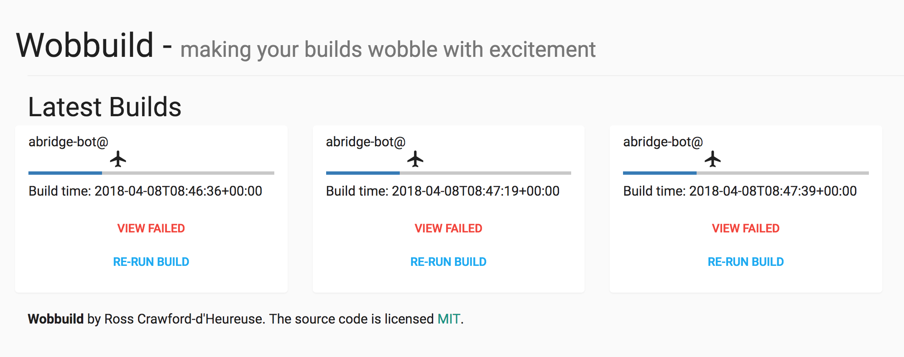

#  wobbuild

A simple build tool.

A bit like travis, but simpler and Open Source.

Concept: build tools suck or are expensive and clicky-draggy

As a developer I want:

1. a simply yaml format configuration for builds
2. a cheap open-source build tool
3. not too clicky-draggy
4. decentralised workers that can be run on any machine (allow a swarm of developers to build their own software without relying on a central limited (expensive) set)
5. shell based, so that we can docker all the things


## 1/3 Server - central web interface


1. `docker-compose up`
2. browse to `http://localhost:5000` - This is the public interface


## 2/3 Client - machines that want things built

Development

`PYTHONPATH=$PYTHONPATH:$PWD python wobbuild/main.py ~/p/abridge-bot/.wobbuild.yml`

Installed

`cd client;python setup.py install`
`wobbuild ~/p/abridge-bot/.wobbuild.yml --target http://localhost:5000`


## 3/3 Workers - machines that process builds

start the worker (celery)

1. `wobbuild worker --redis 127.0.0.1`


### In Projects

Copy this example into one of your projects

```
language: java
clean: false
async: true


#
# Vars gets merged with the GLOBAL_VARS params
#
vars:
  A_VARIABLE: 'foo'
  A_VARIABLE_AGAIN: 'bar'


#
# Match up the build_groups with the appropriate git branches
#
build_group_matcher:
  master: master
  feature: feature/ITDEV-(\d+)
  release: release/(.+)


#
# Master Branch
# Usually For deploy
#
master:
  before_steps:
    - echo "Message to slack"
    # - n v7.5.0
    # - cd patternlab;npm install

  build:
    do: true
    steps:
      - cd patternlab;npm test
      - cd patternlab;npm publish

  publish:
    do: true
    steps:
      - echo "Upload to artifactory"

  deploy:
    do: true
    steps:
      - echo "Deploy using whatever"
      - echo "Step required"

  final_steps:
    - echo "Message to slack"
    - echo "send email"

#
# Feature branches
# Usually just get tested built and packaged
#
feature:
  before_steps:
    - echo "Message to slack"
    # - n v7.5.0
    # - cd patternlab;npm install

  build:
    do: true
    steps:
      - cd patternlab;npm test
      - cd patternlab;npm publish

  publish:
    do: true
    steps:
      - echo "Upload to artifactory"

  deploy:
    do: false
    steps:
      - echo "Upload to artifactory"

  final_steps:
    - echo "Message to slack"


#
# Release branch steps
# Releases usually involve a publish step
#
release:
  before_steps:
    - echo "Message to slack"
    # - n v7.5.0
    # - cd patternlab;npm install

  build:
    do: true
    steps:
      - cd patternlab;npm test
      - cd patternlab;npm publish

  publish:
    do: true
    steps:
      - echo "Upload to artifactory"

  deploy:
    do: false
    steps:
      - echo "Upload to artifactory"

  final_steps:
    - echo "Message to slack"

```

### How it currently looks

yes yes.. im not a designer. aint no body got time for dat.




## Todo

1. Tests
2. Package Client
3. Pipeline Schema validation
4. Integrate with artifactory
5. Build Deploy process (call salt command with appropriate values)
